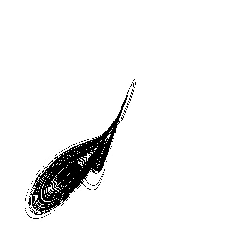

# Ocamlez



An OCaml visualization of the **Lorenz attractor** - a chaotic dynamical system discovered by meteorologist Edward Lorenz.

## About

This program renders a 2D projection of the Lorenz attractor's trajectory using the OCaml Graphics library. The attractor emerges from a simplified model of atmospheric convection and exhibits sensitive dependence on initial conditions (the "butterfly effect").

## Prerequisites

- OCaml 4.14.1+
- opam

## Quick Start

```bash
# Initialize environment (creates local opam switch)
make init
eval $(opam env)

# Build and run
make run
```

Press `Escape` to close the visualization window.

## Command-Line Options

```
ocamlez [options]
Options:
  -s <float>          Prandtl number (default: 10.0)
  --prandtl <float>   Same as -s
  -b <float>          Geometric factor (default: 2.67)
  --geometric <float> Same as -b
  -r <float>          Rayleigh number (default: 28.0)
  --rayleigh <float>  Same as -r
  --size <int>        Window size in pixels (default: 500)
  --scale <float>     Rendering scale factor (default: 5.0)
  -g <int>            Number of iterations (default: 100000)
  --generations <int> Same as -g
  --dt <float>        Time step (default: 0.001)
  -p <file>           Save image to FILE on exit (PPM format)
  --picture <file>    Same as -p
```

### Examples

```bash
# Run with default parameters
make run

# Larger window with more iterations
dune exec ./ocamlez.exe -- --size 800 --generations 200000

# Different Rayleigh number for varied attractor shape
dune exec ./ocamlez.exe -- -r 35.0

# Save output to file
dune exec ./ocamlez.exe -- -p lorenz.ppm
```

## Build Commands

| Command | Description |
|---------|-------------|
| `make init` | Create local opam switch and install dependencies |
| `make` | Build the project |
| `make clean` | Remove build artifacts |
| `make run` | Build and execute |

## The Lorenz System

The attractor is defined by three differential equations:

```
dx/dt = s(y - x)
dy/dt = x(r - z) - y
dz/dt = xy - bz
```

### Parameters

| Parameter | Default | Option | Description |
|-----------|---------|--------|-------------|
| `s` | 10.0 | `-s` / `--prandtl` | Prandtl number |
| `b` | 8/3 | `-b` / `--geometric` | Geometric factor |
| `r` | 28.0 | `-r` / `--rayleigh` | Rayleigh number |

All parameters can be customized via command-line options (see above).

### Visualization Settings

Default values (configurable via command line):

- `--size`: 500px window
- `--scale`: 5.0 (rendering scale factor)
- `-g/--generations`: 100,000 iterations
- `--dt`: 0.001 (time step)

## License

BSD 2-Clause
